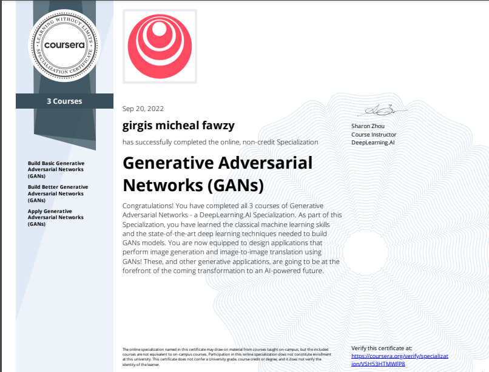

# Generative-Adversarial-Networks-GANs-Specialization-Coursera

## Overview

**Prerequisites:**
- Basic Mathematics
- Deep learning and CNN concepts (Andrew deep learning specialization course 4 is recommended)
- Segmentation and U-net architecture
- PyTorch

**Covered concepts:**
- GANs Basics (discriminator and generator)
- Loss function impact (BCE, and wasserstein) W-Gan-GP, SN-Gan, and Protein-Gan.
- Conditional GANs Vs Controllable Generation.
- GANs evaluation metric (FId, VGG-Loss, Inception score, SSIM, Precision, Recall, and F1 Score)
- Gans weakness and different generative models such as variational autoencoders (VAEs)
- StyleGan, and BigGan components and architecture methodology
- Gans application:
	- Data augmentation and privacy concerns.
	- Image-to-Image Translation models such as Pix2Pix, SRGan, PatchGan, and GauGan.
	- Unpaired image translation models such as CycleGan.

**This specialization consists of three courses as follows:**
- **Build Basic Generative Adversarial Networks (GANs)**
  - **Week 1:** Intro to GANs.
  - **Week 2:** Deep Convolutional GANs .
  - **Week 3:** W-GAN with gredient penalty.
  - **Week 4:** Conditional GAN and Controllable Generation. 
  
- **Build Better Generative Adversarial Networks (GANs)**
  - **Week 1:** Evaluation methods of GANs such as FID and IS.
  - **Week 2:** GANs disadvantages and Bias.
  - **Week 3:** StyleGAN architecture.
  
- **Apply Generative Adversarial Networks (GANs)**
  - **Week 1:** GANs Applications such as Augmentation.
  - **Week 2:** Image-to-image translation with Pix2Pix and U-Net architecture.
  - **Week 3:** Unpaired translation with CycleGAN.
  
## Repo Content
- Lecture Notes
- Assignments 
- Extra Labs
- All papers discussed in this specialization
